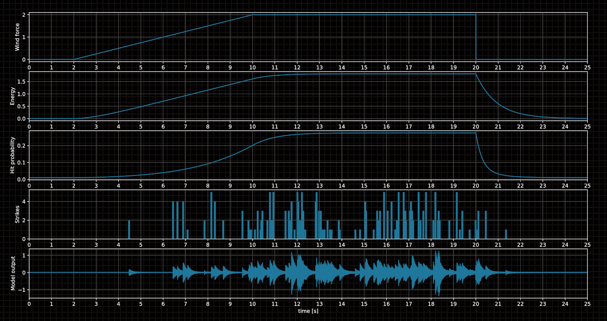

# chimes

Procedural wind chimes sound simulator in C.

Based on the article:

>   "*Modal Synthesis of Wind Chime Sounds with Stochastic
>    Event Triggering*"

>   by Teemu Lukkari and Vesa Välimäki, 2004



Audio output thanks to [RtAudio](https://www.music.mcgill.ca/~gary/rtaudio/).

## Building

```
mkdir deps
cd deps
git clone https://github.com/thestk/rtaudio.git -b 5.2.0
cd rtaudio
./autogen.sh
./configure --prefix=$PWD/../../local
make
make check
make install
cd ../..
mkdir build
cd build
cmake ..
make
```

## Running

```
./chimes
```

You should hear [wind chimes](python/wav/chimes.wav) triggered by simulated random wind gust.

In the directory `rp2040` there is a `Pi Pico` board app generating the sound via PWM.
At sample rate 11025Hz it barely makes it at CPU clock speed of 280MHz. Still fairly
impressive taking into account that it's `Cortex M0+` without FPU.

## Other

 - `modesynth` - Python scripts for extracting modes from a WAV file

   
